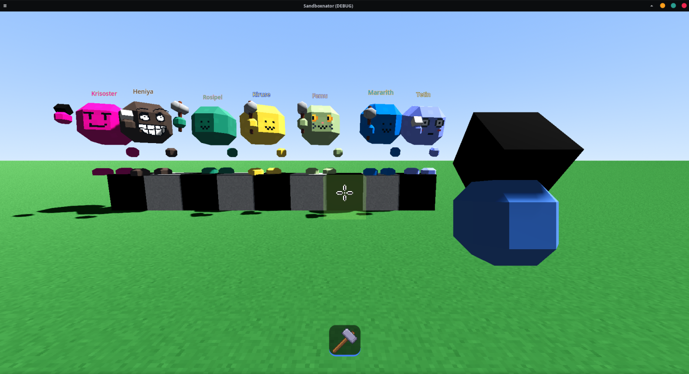
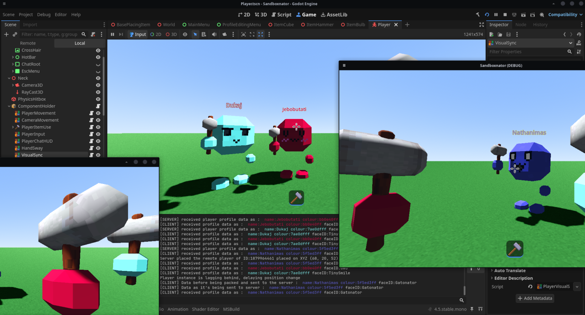
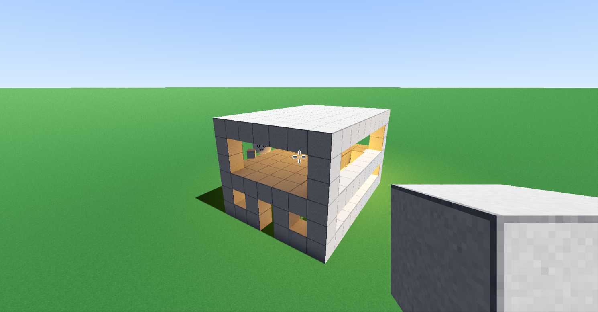
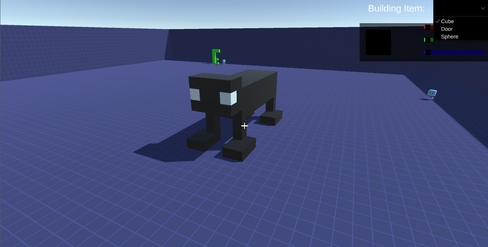

<!-- Banner / Logo -->
<p align="center">
  
</p>

<h1 align="center">Sandboxnator</h1>
<p align="center">
  <b>A very experimental multiplayer sandbox game.</b>
</p>

<p align="center">
  <a href="https://github.com/TheGBO/SandboxnatorReinassanceGodot/stargazers">
    
  </a>
  <a href="https://github.com/TheGBO/SandboxnatorReinassanceGodot/issues">
    
  </a>
  <a href="https://github.com/TheGBO/SandboxnatorReinassanceGodot/blob/main/LICENSE.md">
    
  </a>
  <a href="https://godotengine.org/">
    
  </a>
  <a href="https://discord.gg/RgyyWE7SnD">
  
    </a>
  
</p>


## Screenshots
<p align="center">
  
  
  
</p>


## Getting Started
Clone the repository:
```bash
git clone https://github.com/TheGBO/SandboxnatorReinassanceGodot.git
```
- License TLDR; do anything you want as long as you credit me and it's not commercial.

## Legacy Version (R.I.P)
- First ever multiplayer sandboxnator game whose source code was lost ~~but~~ even to God. (absolute lost media, I f---ed up so bad before learning git to backup my stuff :C )
The tech stack was: Unity, C# and Mirror
