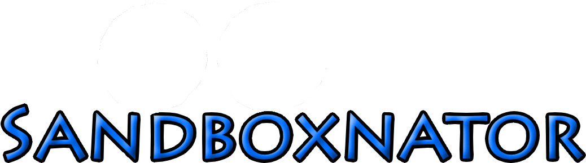

<!-- Banner / Logo -->
<p align="center">
  
</p>

<h1 align="center">🌍 Sandboxnator</h1>
<p align="center">
  <b>A very experimental multiplayer sandbox game.</b>
</p>

<p align="center">
  <a href="https://github.com/TheGBO/SandboxnatorReinassanceGodot/stargazers">
    
  </a>
  <a href="https://github.com/TheGBO/SandboxnatorReinassanceGodot/issues">
    
  </a>
  <a href="https://github.com/TheGBO/SandboxnatorReinassanceGodot/blob/main/LICENSE.md">
    
  </a>
  <a href="https://godotengine.org/">
    
  </a>
  <a href="https://discord.gg/RgyyWE7SnD">
  
    </a>
  
</p>

---

## ✨ Features (The whole game is still in progress)
- 🏗️ **Freeform Building** – Place, rotate, and snap objects however you want.
- 🌐 **Multiplayer Sync** – Powered by Godot 4’s multiplayer ENet API.
- 🧩 **Modular Systems** – Custom player components, extensible commands, and more.
- 🎮 **Godot 4 Mono (C#)** – Full power of C# for modularity and performance.

---

## 📸 Showcase
<p align="center">
  
</p>

<p align="center">
  <i>Build, rotate, destroy, chat...</i>
</p>

---

## 🛠 Tech Stack
- **Engine:** [Godot 4 Mono](https://godotengine.org/)
- **Language:** C#
- **Networking:** Godot Multiplayer API
- **Architecture:** Modular components, sync systems, and extensible commands

---

## 🚀 Getting Started
Clone the repository:
```bash
git clone https://github.com/TheGBO/SandboxnatorReinassanceGodot.git
```
- Make your own mods :P (read the license before publishing them, please)

## Legacy Version (R.I.P)
- First ever multiplayer sandboxnator game whose source code was lost but to God.
The tech stack was: Unity, C# and Mirror
